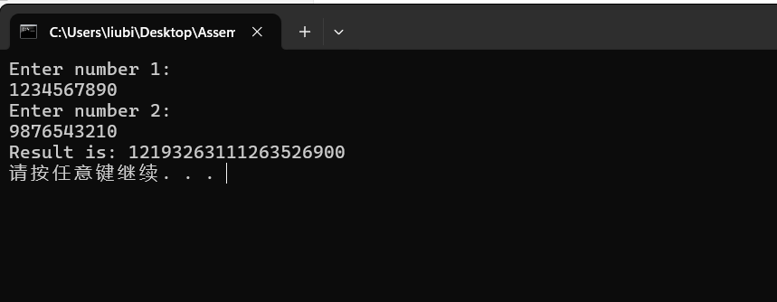
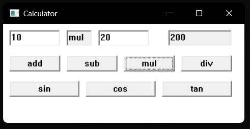
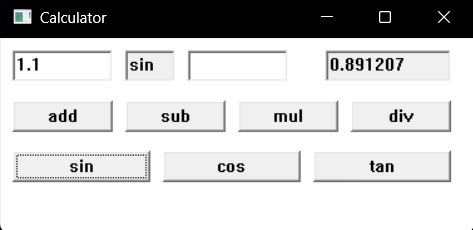
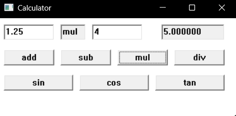
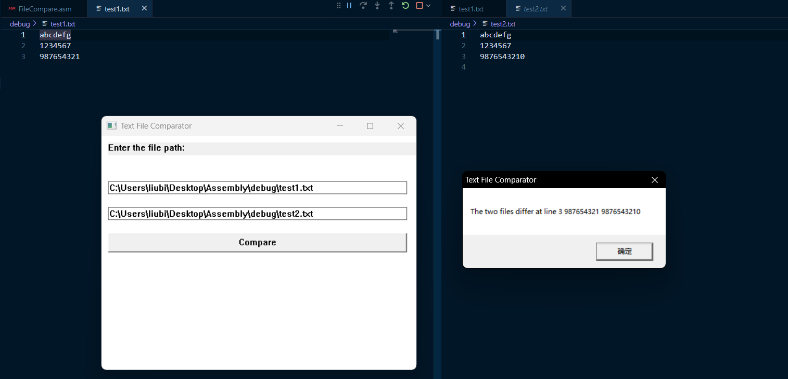

>班级：07112201
>学号：1120220715
>姓名：刘秉致

# 实验环境说明
***
- 采用VScode编写汇编程序
- 使用MASM32 SDK提供的汇编器和链接器
- 在Windows11系统采用兼容模式执行程序

# 实验一：大数相乘
***
## 程序功能描述
***
用户输入两个十进制大整数（100位以上），程序对两个大整数进行乘法运算并返回结果

## 实现思路
***
- 由于两个大整数的远远超过了32位寄存器可以容纳的范围，因此我们考虑将两个大整数以数组的形式存入数据段内
- 为了便于数据的计算，我们将传入的数组中的每个字符都变为数字，并反着存入数组中
- 对其中一个乘数，从低位向高位按位与另一个乘数进行乘法操作，构成循环
- 在乘法过程中不考虑进位，而是将乘法的结果以十进制向量的方式存入暂存数组
- 对暂存数组的每一个元素进行进位操作：`temp[i+1] += temp[i]/10`, `temp[i] = temp[i]%10`
- 最后再将暂存数组中的每个数转化为字符并反着存入目标数组
- 判断结果正负，如果为负，输出时加一个负号

## 函数实现
***
```assembly
.386
.model flat,stdcall
option casemap:none

include \masm32\include\masm32.inc
include \masm32\include\kernel32.inc
include \masm32\include\msvcrt.inc

includelib \masm32\lib\masm32.lib
includelib \masm32\lib\kernel32.lib
includelib \masm32\lib\msvcrt.lib

printf PROTO C :DWORD,:VARARG
gets PROTO C :DWORD
strlen PROTO C :DWORD

;---------------------------------------------
.DATA
;缓冲区
sbuffer1 byte 256 dup(0);大数1缓冲区
sbuffer2 byte 256 dup(0);大数2缓冲区
sresult byte 513 dup(0);结果缓冲区
ibuffer1 dword 256 dup(0);存放数字1的反写数字串
ibuffer2 dword 256 dup(0);存放数字2的反写字符串
iresult dword 513 dup(0);存放结果数字的反写字符串

;提示信息
enter1 byte "Enter number 1:",0ah,0
enter2 byte "Enter number 2:",0ah,0
posresult byte "Result is: %s",0ah,0
negresult byte "Result is: -%s",0ah,0

;格式化字符串
form_in byte "%s",0
intstr byte "%d,%d,%d",0ah,0


;全局变量
lenth1 dword 0;ibuffer1长
lenth2 dword 0;ibuffer2长
lenthr dword 0;iresult长
negtive byte 0;结果负否
radix dword 10;除数
;-----------------------------------------------

;-----------------------------------------------
.CODE
;================================================
;brief:将字符串转化为数字并反转存入地址，过程中判断该数负否
;param:
;    src-源地址
;    dst-目的地址
;return:
;    字符串长度
S2I PROC stdcall src:DWORD,dst:DWORD
    LOCAL len:DWORD
    ;保存寄存器
    push esi
    push ecx

    mov esi,src
    .if byte ptr[esi] == 2DH  ;如果为负数
        xor negtive,1 ;符号作用一次
        inc esi
    .endif

    invoke strlen,esi;从esi位置起计算长度
    mov len,eax
    mov ecx,len
L1:
    ;获得数字压入栈
    ;eax=esi[i]
    movzx eax,byte ptr[esi]
    sub eax,'0';转换为数字
    
    push eax;压栈
    inc esi
    loop L1

    ;读出数字
    mov ecx,len
    mov esi,dst
L2:
    pop eax
    mov dword ptr[esi],eax
    add esi,4
    loop L2
    
    mov eax,len
    
    ;恢复寄存器
    pop ecx
    pop esi
    ret
S2I ENDP
;===============================================

;===============================================
;brief:将数字串处理进位后转化为字符并反转存入地址
;param:
;    src-源字符串地址
;    dest-目的字符串地址
;return:
;    字符串长度
I2S PROC stdcall src:DWORD,dst:DWORD
    ;保护寄存器
    push ecx
    push esi
    push edx
	
	
    ;采用循环进行进位,src的长度在lenthr中
    mov ecx,lenthr
    mov esi,src
L3:
    mov eax,dword ptr[esi]
    xor edx,edx
    div radix
    add dword ptr[esi+4],eax;商进位
    mov dword ptr[esi],edx;余数写入
    add esi,4
    loop L3

    ;进位处理完毕，考虑从后向前遍历结果确定真实长度
    mov esi,src
    mov ecx,lenthr
L4:
    cmp dword ptr iresult[4*ecx],0
    jne endL4
    dec ecx
    jmp L4
endL4:
    ;写入真实长度
    inc ecx
    mov lenthr,ecx
    
    ;将结果写入dst
    mov esi,src
L5:
    mov eax,dword ptr[esi]
    add eax,'0'
    push eax
    add esi,4
    loop L5
    
    mov esi,dst
    mov ecx,lenthr
L6:
    pop eax
    mov byte ptr[esi],al
    inc esi
    loop L6

    ;恢复寄存器
    pop edi
    pop edx
    pop esi
    pop ecx
    ret
I2S ENDP
;================================================


;================================================
;brief:大数乘法
;param:
;    num1-大数1地址
;    num2-大数2地址
;    result-结果地址
;return:
;    无
BigMultiple PROC stdcall num1:DWORD,num2:DWORD,result:DWORD
    ;保存寄存器
    push ebx
    push ecx
    push edx
    push esi
    push edi

    ;获取两个大数长度并反转
    invoke S2I,num1,offset ibuffer1
    mov lenth1,eax

    invoke S2I,num2,offset ibuffer2
    mov lenth2,eax


    mov ebx,0;外层索引i
outer:
    cmp ebx,lenth1
    jnb end_outer
    xor ecx,ecx;内层索引j
inner:
    xor edx,edx
    mov eax,dword ptr ibuffer1[4*ebx];num1的当前位
    mul dword ptr ibuffer2[4*ecx];num1*num2->edx:eax
    
    ;写入结果
    mov esi,ebx
    add esi,ecx;edi=ebx+ecx为结果本位
    add dword ptr iresult[4*esi],eax;先将结果写入再调用函数处理进位
    inc ecx
    cmp ecx,lenth2
    jb inner
    inc ebx
    jmp outer
end_outer:
    ;给出iresult的可能长度
    mov ecx,lenth1
    add ecx,lenth2
    inc ecx;lenthr=lenth1+lenth2+1
    mov lenthr,ecx
    ;调用函数处理结果
    invoke I2S,offset iresult,result

    ;恢复寄存器
    pop edi
    pop esi
    pop edx
    pop ecx
    pop ebx
    ret
BigMultiple ENDP
;================================================

;========================主函数==================
start:         
    ;输入两个大数
    invoke printf,offset enter1
    invoke gets,offset sbuffer1
    invoke printf,offset enter2
    invoke gets,offset sbuffer2
       
    ;调用大数乘法函数
    invoke BigMultiple,offset sbuffer1,offset sbuffer2,offset sresult
    ;输出结果
    .if negtive==1
        invoke printf,offset negresult,offset sresult
    .else
        invoke printf,offset posresult,offset sresult
    .endif
    ret
;================================================
END start
```

## 实验结果
***
*测试用例*
为了便于显示测试结果，我们采用$10 \times 10$的测试用例
>num1 = 1234567890
>num2 = 9876543210
>result=  12193263111263526900



# 实验二：计算器实现
***
## 程序功能描述
***
结合Windows界面编程和浮点数编程，实现完善的计算器功能，支持浮点运算和三角函数等功能。

## 实现思路
***
考虑到Win32汇编编程已经支持了要求的浮点运算，因此上只需要对Windows界面编程进行一定的学习，即可实现一个简单的计算器。
Win32程序是基于消息实现功能的，即用户的每一个操作都对应的产生一个消息。每个程序实例在执行过程中都会不断的执行一个消息监听和处理循环。进程都有一个过程函数，其中指定了程序对消息的处理。
要创建一个Win32界面风格的程序，需要在程序内自行定义窗口类，并将窗口类注册；之后，创建该窗口类的一个实例，并向其中加入文本框来接受用户指定的操作数；文本框下通过设计指定的运算符按钮，来产生对应的消息，将程序引入不同的处理分支；每个分支对应了一种运算。
同时，考虑到用户输入整数时，输出结果应当也为整数。因此在读入数字后，对该数组进行一次遍历，判断字符串是否有小数点，有则转浮点运算；否则进行正常的整数运算。

## 函数实现
***
```assembly
.386
.model flat, stdcall
option casemap:none

include \masm32\include\windows.inc
include \masm32\include\kernel32.inc
include \masm32\include\user32.inc
include \masm32\include\msvcrt.inc

includelib \masm32\lib\kernel32.lib
includelib \masm32\lib\user32.lib
includelib \masm32\lib\msvcrt.lib

atof PROTO C:DWORD
atoi PROTO C:DWORD
sprintf PROTO C:DWORD,:VARARG

; 常量定义
ID_BTN_ADD     equ 1001    ; 加法按钮ID
ID_BTN_SUB     equ 1002    ; 减法按钮ID
ID_BTN_MUL     equ 1003    ; 乘法按钮ID
ID_BTN_DIV     equ 1004    ; 除法按钮ID
ID_BTN_SIN     equ 1005    ; 正弦按钮ID
ID_BTN_COS     equ 1006    ; 余弦按钮ID
ID_BTN_TAN     equ 1007    ; 正切按钮ID
ID_EDIT1       equ 2001    ; 第一个输入框ID
ID_EDIT2       equ 2002    ; 第二个输入框ID
ID_EDIT_RESULT equ 2003    ; 结果输出框ID
ID_EDIT_OP     equ 2004    ; 运算符号显示框ID

.data
ClassName    db "CalcWinClass", 0
AppName      db "Calculator", 0
EditClass    db "EDIT", 0
ButtonClass  db "BUTTON", 0
fmt_int      db "%d", 0
fmt_float    db "%f", 0
fmt_str      db "%s", 0
btn_add      db "add", 0
btn_sub      db "sub", 0
btn_mul      db "mul", 0
btn_div      db "div", 0
btn_sin      db "sin", 0
btn_cos      db "cos", 0
btn_tan      db "tan", 0

hInstance   dd 0
hWnd        dd 0
hwndEdit1   dd 0
hwndEdit2   dd 0
hwndResult  dd 0
buffer      db 256 dup(0)
msg         MSG <>
wc          WNDCLASSEX <>


.code
start:
    invoke GetModuleHandle, NULL
    mov    hInstance, eax
    
    ; 注册窗口类
    call   RegisterWinClass
    
    ; 创建主窗口
    invoke CreateWindowEx, WS_EX_CLIENTEDGE, \
           ADDR ClassName, ADDR AppName, \
           WS_OVERLAPPEDWINDOW, \
           CW_USEDEFAULT, CW_USEDEFAULT, \
           400, 200, NULL, NULL, \
           hInstance, NULL
    mov   hWnd, eax

    ; 消息循环
    invoke ShowWindow, eax, SW_SHOWNORMAL
    invoke UpdateWindow, eax
    
    .while TRUE
        invoke GetMessage, ADDR msg, NULL, 0, 0
        .break .if (!eax)
        invoke TranslateMessage, ADDR msg
        invoke DispatchMessage, ADDR msg
    .endw
    
    ret

RegisterWinClass proc

    mov wc.cbSize, sizeof WNDCLASSEX
    mov wc.style, CS_HREDRAW or CS_VREDRAW
    mov wc.lpfnWndProc, offset WndProc
    mov wc.cbClsExtra, 0
    mov wc.cbWndExtra, 0
    push hInstance
    pop wc.hInstance
    mov wc.hbrBackground, COLOR_WINDOW+1
    mov wc.lpszMenuName, NULL
    mov wc.lpszClassName, offset ClassName
    
    invoke RegisterClassEx, addr wc
    ret
RegisterWinClass endp

WndProc proc hWin:HWND, uMsg:UINT, wParam:WPARAM, lParam:LPARAM
    local ps:PAINTSTRUCT
    
    .if uMsg == WM_CREATE
        ; 输入框1
        invoke CreateWindowEx, WS_EX_CLIENTEDGE, \
               ADDR EditClass, NULL, \
               WS_CHILD or WS_VISIBLE or ES_AUTOHSCROLL, \
               10, 10, 80, 25, hWin, ID_EDIT1, \
               hInstance, NULL
        mov hwndEdit1, eax
        ; 输入框2
        invoke CreateWindowEx, WS_EX_CLIENTEDGE, \
            ADDR EditClass, NULL, \
            WS_CHILD or WS_VISIBLE or ES_AUTOHSCROLL, \
            150, 10, 80, 25, hWin, ID_EDIT2, \
            hInstance, NULL
        mov hwndEdit2, eax
        ; 结果输出框
        invoke CreateWindowEx, WS_EX_CLIENTEDGE, \
            ADDR EditClass, NULL, \
            WS_CHILD or WS_VISIBLE or ES_READONLY, \
            260, 10, 100, 25, hWin, ID_EDIT_RESULT, \
            hInstance, NULL
        mov hwndResult, eax
        ; 运算符号显示框
        invoke CreateWindowEx, WS_EX_CLIENTEDGE, \
            ADDR EditClass, NULL, \
            WS_CHILD or WS_VISIBLE or ES_READONLY, \
            100, 10, 40, 25, hWin, ID_EDIT_OP, \
            hInstance, NULL
        ; 加法按钮
        invoke CreateWindowEx, NULL, \
            ADDR ButtonClass, ADDR btn_add, \
            WS_CHILD or WS_VISIBLE or BS_PUSHBUTTON, \
            10, 50, 80, 25, hWin, ID_BTN_ADD, \
            hInstance, NULL
        ; 减法按钮
        invoke CreateWindowEx, NULL, \
            ADDR ButtonClass, ADDR btn_sub, \
            WS_CHILD or WS_VISIBLE or BS_PUSHBUTTON, \
            100, 50, 80, 25, hWin, ID_BTN_SUB, \
            hInstance, NULL
        ; 乘法按钮
        invoke CreateWindowEx, NULL, \
            ADDR ButtonClass, ADDR btn_mul, \
            WS_CHILD or WS_VISIBLE or BS_PUSHBUTTON, \
            190, 50, 80, 25, hWin, ID_BTN_MUL, \
            hInstance, NULL
        ; 除法按钮
        invoke CreateWindowEx, NULL, \
            ADDR ButtonClass, ADDR btn_div, \
            WS_CHILD or WS_VISIBLE or BS_PUSHBUTTON, \
            280, 50, 80, 25, hWin, ID_BTN_DIV, \
            hInstance, NULL
        ; 正弦按钮
        invoke CreateWindowEx, NULL, \
            ADDR ButtonClass, ADDR btn_sin, \
            WS_CHILD or WS_VISIBLE or BS_PUSHBUTTON, \
            10, 90, 110, 25, hWin, ID_BTN_SIN, \
            hInstance, NULL
        ; 余弦按钮
        invoke CreateWindowEx, NULL, \
            ADDR ButtonClass, ADDR btn_cos, \
            WS_CHILD or WS_VISIBLE or BS_PUSHBUTTON, \
            130, 90, 110, 25, hWin, ID_BTN_COS, \
            hInstance, NULL
        ; 正切按钮
        invoke CreateWindowEx, NULL, \
            ADDR ButtonClass, ADDR btn_tan, \
            WS_CHILD or WS_VISIBLE or BS_PUSHBUTTON, \
            250, 90, 110, 25, hWin, ID_BTN_TAN, \
            hInstance, NULL
        
    .elseif uMsg == WM_COMMAND
        ; 处理按钮点击事件
        mov eax, wParam
        .if ax == ID_BTN_ADD
            call PerformAdd
        .elseif ax == ID_BTN_SUB
            call PerformSub
        .elseif ax == ID_BTN_MUL
            call PerformMul
        .elseif ax == ID_BTN_DIV
            call PerformDiv
        .elseif ax == ID_BTN_SIN
            call PerformSin
        .elseif ax == ID_BTN_COS
            call PerformCos
        .elseif ax == ID_BTN_TAN
            call PerformTan
        .endif
        
    .elseif uMsg == WM_DESTROY
        invoke PostQuitMessage, 0
        
    .else
        invoke DefWindowProc, hWin, uMsg, wParam, lParam
        ret
    .endif
    
    xor eax, eax
    ret
WndProc endp

; 根据是否具有小数点，判断一个浮点数是否为整数
IsInt proc num:ptr byte
    xor eax,eax
    .while num != 0
        .if num == '.'
            ret
        .endif
        inc num
    .endw
    mov eax, 1
    ret
   
IsInt endp

; 执行加法运算
PerformAdd proc
    local temp1:QWORD, temp2:QWORD
    local int1:DWORD, int2:DWORD

    ;判断是否是整数
    invoke GetDlgItemText, hWnd, ID_EDIT1, ADDR buffer, 256
    invoke IsInt, ADDR buffer
    .if eax == 0
        jmp add_float
    .endif
    invoke atoi, ADDR buffer
    mov int1, eax

    invoke GetDlgItemText, hWnd, ID_EDIT2, ADDR buffer, 256
    invoke IsInt, ADDR buffer
    .if eax == 0
        jmp add_float
    .endif
    invoke atoi, ADDR buffer
    mov int2, eax

    ; 执行加法
    mov eax, int1
    add eax, int2
    mov int1, eax
    ; 显示结果
    invoke sprintf, ADDR buffer, ADDR fmt_str, ADDR btn_add
    invoke SetDlgItemText, hWnd, ID_EDIT_OP, ADDR buffer
    invoke sprintf, ADDR buffer, ADDR fmt_int,int1 
    invoke SetDlgItemText, hWnd, ID_EDIT_RESULT, ADDR buffer
    ret
    
add_float:    
    finit

    ; 获取输入值并转换为浮点数
    invoke GetDlgItemText, hWnd, ID_EDIT1, ADDR buffer, 256
    invoke atof, ADDR buffer
    fstp temp1
    
    invoke GetDlgItemText, hWnd, ID_EDIT2, ADDR buffer, 256
    invoke atof, ADDR buffer
    fstp temp2
    
    ; 执行加法
    fld temp1
    fadd temp2
    fstp temp1
    
    ; 显示结果
    invoke sprintf, ADDR buffer, ADDR fmt_str, ADDR btn_add
    invoke SetDlgItemText, hWnd, ID_EDIT_OP, ADDR buffer
    invoke sprintf, ADDR buffer, ADDR fmt_float, temp1
    invoke SetDlgItemText, hWnd, ID_EDIT_RESULT, ADDR buffer
    
    ret
PerformAdd endp

; 执行减法运算
PerformSub proc
    local temp1:QWORD, temp2:QWORD
    local int1:DWORD, int2:DWORD

    ;判断是否是整数
    invoke GetDlgItemText, hWnd, ID_EDIT1, ADDR buffer, 256
    invoke IsInt, ADDR buffer
    .if eax == 0
        jmp sub_float
    .endif
    invoke atoi, ADDR buffer
    mov int1, eax

    invoke GetDlgItemText, hWnd, ID_EDIT2, ADDR buffer, 256
    invoke IsInt, ADDR buffer
    .if eax == 0
        jmp sub_float
    .endif
    invoke atoi, ADDR buffer
    mov int2, eax

    ; 执行减法
    mov eax,int1
    sub eax,int2
    mov int1,eax
    ; 显示结果
    invoke sprintf, ADDR buffer, ADDR fmt_str, ADDR btn_sub
    invoke SetDlgItemText, hWnd, ID_EDIT_OP, ADDR buffer
    invoke sprintf, ADDR buffer, ADDR fmt_int, int1
    invoke SetDlgItemText, hWnd, ID_EDIT_RESULT, ADDR buffer
    ret

sub_float:
    finit
    
    ; 获取输入值并转换为浮点数
    invoke GetDlgItemText, hWnd, ID_EDIT1, ADDR buffer, 256
    invoke atof, ADDR buffer
    fstp temp1
    
    invoke GetDlgItemText, hWnd, ID_EDIT2, ADDR buffer, 256
    invoke atof, ADDR buffer
    fstp temp2
    
    ; 执行减法
    fld temp1
    fsub temp2
    fstp temp1
    
    ; 显示结果
    invoke sprintf, ADDR buffer, ADDR fmt_str, ADDR btn_sub
    invoke SetDlgItemText, hWnd, ID_EDIT_OP, ADDR buffer
    invoke sprintf, ADDR buffer, ADDR fmt_float, temp1
    invoke SetDlgItemText, hWnd, ID_EDIT_RESULT, ADDR buffer
    
    ret
PerformSub endp

; 执行乘法运算
PerformMul proc
    local temp1:QWORD, temp2:QWORD
    local int1:DWORD, int2:DWORD

    ;判断是否是整数
    invoke GetDlgItemText, hWnd, ID_EDIT1, ADDR buffer, 256
    invoke IsInt, ADDR buffer
    .if eax == 0
        jmp mul_float
    .endif
    invoke atoi, ADDR buffer
    mov int1, eax

    invoke GetDlgItemText, hWnd, ID_EDIT2, ADDR buffer, 256
    invoke IsInt, ADDR buffer
    .if eax == 0
        jmp mul_float
    .endif
    invoke atoi, ADDR buffer
    mov int2, eax

    ; 执行乘法
    mov eax, int1
    imul eax, int2
    mov int1, eax
    ; 显示结果
    invoke sprintf, ADDR buffer, ADDR fmt_str, ADDR btn_mul
    invoke SetDlgItemText, hWnd, ID_EDIT_OP, ADDR buffer
    invoke sprintf, ADDR buffer, ADDR fmt_int, int1
    invoke SetDlgItemText, hWnd, ID_EDIT_RESULT, ADDR buffer
    ret


mul_float:
    finit
    
    ; 获取输入值并转换为浮点数
    invoke GetDlgItemText, hWnd, ID_EDIT1, ADDR buffer, 256
    invoke atof, ADDR buffer
    fstp temp1
    
    invoke GetDlgItemText, hWnd, ID_EDIT2, ADDR buffer, 256
    invoke atof, ADDR buffer
    fstp temp2
    
    ; 执行乘法
    fld temp1
    fmul temp2
    fstp temp1
    
    ; 显示结果
    invoke sprintf, ADDR buffer, ADDR fmt_str, ADDR btn_mul
    invoke SetDlgItemText, hWnd, ID_EDIT_OP, ADDR buffer
    invoke sprintf, ADDR buffer, ADDR fmt_float, temp1
    invoke SetDlgItemText, hWnd, ID_EDIT_RESULT, ADDR buffer
    
    ret
PerformMul endp

; 执行除法运算
PerformDiv proc
    local temp1:QWORD, temp2:QWORD
    local int1:DWORD, int2:DWORD

    ;判断是否是整数
    invoke GetDlgItemText, hWnd, ID_EDIT1, ADDR buffer, 256
    invoke IsInt, ADDR buffer
    .if eax == 0
        jmp div_float
    .endif
    invoke atoi, ADDR buffer
    mov int1, eax

    invoke GetDlgItemText, hWnd, ID_EDIT2, ADDR buffer, 256
    invoke IsInt, ADDR buffer
    .if eax == 0
        jmp div_float
    .endif
    invoke atoi, ADDR buffer
    mov int2, eax

    ; 执行除法
    xor edx,edx
    mov eax, int1
    idiv int2
    mov int1, eax
    ; 显示结果
    invoke sprintf, ADDR buffer, ADDR fmt_str, ADDR btn_div
    invoke SetDlgItemText, hWnd, ID_EDIT_OP, ADDR buffer
    invoke sprintf, ADDR buffer, ADDR fmt_int, int1
    invoke SetDlgItemText, hWnd, ID_EDIT_RESULT, ADDR buffer
    ret


div_float:    
    finit   
    ; 获取输入值并转换为浮点数
    invoke GetDlgItemText, hWnd, ID_EDIT1, ADDR buffer, 256
    invoke atof, ADDR buffer
    fstp temp1
    
    invoke GetDlgItemText, hWnd, ID_EDIT2, ADDR buffer, 256
    invoke atof, ADDR buffer
    fstp temp2
    
    ; 执行除法
    fld temp1
    fdiv temp2
    fstp temp1
    
    ; 显示结果
    invoke sprintf, ADDR buffer, ADDR fmt_str, ADDR btn_div
    invoke SetDlgItemText, hWnd, ID_EDIT_OP, ADDR buffer
    invoke sprintf, ADDR buffer, ADDR fmt_float, temp1
    invoke SetDlgItemText, hWnd, ID_EDIT_RESULT, ADDR buffer
    
    ret
PerformDiv endp

; 执行正弦运算
PerformSin proc
    local temp1:QWORD
    
    ; 获取输入值并转换为浮点数
    invoke GetDlgItemText, hWnd, ID_EDIT1, ADDR buffer, 256
    invoke atof, ADDR buffer
    fstp temp1
    
    ; 执行正弦
    fld temp1
    fsin; 计算正弦值并存入xmm0寄存器中
    fstp temp1; 将结果存入temp1中
    
    ; 显示结果
    invoke sprintf, ADDR buffer, ADDR fmt_str, ADDR btn_sin
    invoke SetDlgItemText, hWnd, ID_EDIT_OP, ADDR buffer
    invoke sprintf, ADDR buffer, ADDR fmt_float, temp1
    invoke SetDlgItemText, hWnd, ID_EDIT_RESULT, ADDR buffer
    
    ret
PerformSin endp

; 执行余弦运算
PerformCos proc
    local temp1:QWORD
    
    ; 获取输入值并转换为浮点数
    invoke GetDlgItemText, hWnd, ID_EDIT1, ADDR buffer, 256
    invoke atof, ADDR buffer
    fstp temp1
    
    ; 执行余弦
    fld temp1
    fcos
    fstp temp1
    
    ; 显示结果
    invoke sprintf,ADDR buffer, ADDR fmt_str, ADDR btn_cos
    invoke SetDlgItemText, hWnd, ID_EDIT_OP, ADDR buffer
    invoke sprintf, ADDR buffer, ADDR fmt_float, temp1
    invoke SetDlgItemText, hWnd, ID_EDIT_RESULT, ADDR buffer
    
    ret
PerformCos endp

; 执行正切运算
PerformTan proc
    local temp1:QWORD
    
    ; 获取输入值并转换为浮点数
    invoke GetDlgItemText, hWnd, ID_EDIT1, ADDR buffer, 256
    invoke atof, ADDR buffer
    fstp temp1
    
    ; 执行正切
    fld temp1
    fptan; 计算正切值并存入xmm0寄存器中
    fstp temp1; 将结果存入temp1中
    
    ; 显示结果
    invoke sprintf, ADDR buffer, ADDR fmt_str, ADDR btn_tan
    invoke SetDlgItemText, hWnd, ID_EDIT_OP, ADDR buffer
    invoke sprintf, ADDR buffer, ADDR fmt_float, temp1
    invoke SetDlgItemText, hWnd, ID_EDIT_RESULT, ADDR buffer
    
    ret
PerformTan endp


end start
```

## 实验结果
***
编译链接并运行，测试整数和浮点数运算和三角函数运算，运算正确





# 实验三：文件比较
***
## 程序功能描述
***
Windows 界面风格实现两个文本文件内容的比对。若两文件内容一样， 输出相应提示；若两文件不一样，输出对应的行号

## 实现思路
***
- 采用Windows界面风格，因此需要向实验二一样创建窗口类并注册，之后创建窗口实例，不断监听消息
- 在窗口中实现两个文本框作为用户输入文件路径的接口，程序从中读取比较文件的路径
- 将两个文件按行打开，读入缓冲区后判断是否字符串一致，不一致直接输出结果，一致则继续循环直到比对完成

## 函数实现
***
```assembly
.386
.model flat, stdcall
option casemap:none

include \masm32\include\windows.inc
include \masm32\include\kernel32.inc
include \masm32\include\user32.inc
include \masm32\include\msvcrt.inc

includelib \masm32\lib\kernel32.lib
includelib \masm32\lib\user32.lib
includelib \masm32\lib\msvcrt.lib

; 常量定义
BUFFER_SIZE EQU 1024
INVALID_HANDLE_VALUE EQU -1
EDITSTYLE     equ (WS_CHILD or WS_VISIBLE or WS_BORDER or ES_AUTOHSCROLL)
BUTTONSTYLE   equ (WS_CHILD or WS_VISIBLE or BS_PUSHBUTTON)


.data
    szWindowTitle db "Text File Comparator", 0
    szSame        db "The two files are the same.", 0
    szDiff        db "The two files differ at line %d %s %s", 0
    szFilePath1   db 256 dup(0)
    szFilePath2   db 256 dup(0)
    szMessage     db 512 dup(0)
    szEnter       db "Enter the file path:", 0
    szBuffer1     db 256 dup(0)
    szBuffer2     db 256 dup(0)
    szErrorOpen   db "Error opening files!", 0
    szErrorReg    db "RegisterClassEx failed!", 0
    szErrorIns    db "GetModuleHandle failed!", 0

    hInstance     dd 0
    hWnd          dd 0
    hEditFile1    dd 0
    hEditFile2    dd 0
    hButton       dd 0
    wc            WNDCLASSEX <>
    msg           MSG <>
    
    szEditClass   db "EDIT", 0
    szButtonClass db "BUTTON", 0
    szCompareText db "Compare", 0
    szClassName   db "FileCompareClass", 0
    szStaticClass db "STATIC", 0

.code
;Read one line from file
ReadOneLine PROC filehandle:HANDLE,buffer:DWORD
    LOCAL fileptr:DWORD
    LOCAL input_char:BYTE
    
    push ebx
    
    mov ebx,buffer
    .while TRUE
        invoke ReadFile,filehandle,addr input_char,1,addr fileptr,NULL
        .break .if !fileptr;EOF
        .break .if input_char == 10;LF
        mov AL,input_char
        mov [ebx],AL
        inc ebx
    .endw

    mov AL,0
    mov [ebx],AL;NULL ending
    invoke lstrlen,buffer
    pop ebx
    ret
ReadOneLine ENDP

;Open file for comparison
CompareFiles PROC
    LOCAL filehandle1:HANDLE
    LOCAL filehandle2:HANDLE
    LOCAL ptr1:DWORD
    LOCAL ptr2:DWORD
    LOCAL line:DWORD
    LOCAL differentline[1000]:BYTE

    mov line, 0

  
    invoke GetWindowText,hEditFile1,addr szFilePath1,sizeof szFilePath1
    invoke GetWindowText,hEditFile2,addr szFilePath2,sizeof szFilePath2

    
    ; 打开第一个文件
    invoke CreateFile,
        addr szFilePath1,
        GENERIC_READ,
        FILE_SHARE_READ,
        NULL,
        OPEN_EXISTING,
        FILE_ATTRIBUTE_NORMAL,
        NULL 
    mov filehandle1, eax
    
    ; 检查第一个文件是否打开成功
    .if eax == INVALID_HANDLE_VALUE
        invoke MessageBox, 0, addr szErrorOpen, addr szWindowTitle, MB_OK
        ret     ; 直接返回，因为第一个文件就打开失败了
    .endif

    ; 打开第二个文件
    invoke CreateFile,
        addr szFilePath2,
        GENERIC_READ,
        FILE_SHARE_READ,
        NULL,
        OPEN_EXISTING,
        FILE_ATTRIBUTE_NORMAL,
        NULL
    mov filehandle2, eax
    
    ; 检查第二个文件是否打开成功
    .if eax == INVALID_HANDLE_VALUE
        invoke MessageBox, 0, addr szErrorOpen, addr szWindowTitle, MB_OK
        invoke CloseHandle, filehandle1  ; 关闭第一个文件
        ret
    .endif

READ_LINE_START:
    inc line
    invoke RtlZeroMemory,addr szBuffer1,sizeof szBuffer1
    invoke ReadOneLine,filehandle1,addr szBuffer1
    mov ptr1,eax
    invoke RtlZeroMemory,addr szBuffer2,sizeof szBuffer2
    invoke ReadOneLine,filehandle2,addr szBuffer2
    mov ptr2,eax

    cmp ptr1,0
    jne FILE1_NOT_EMPTY
    cmp ptr2,0
    je COMPARE_END
    jmp DIFFERENT_LINE_FOUND

FILE1_NOT_EMPTY:
    cmp ptr2,0
    jne BOTH_NOT_EMPTY
    jmp DIFFERENT_LINE_FOUND

BOTH_NOT_EMPTY:
    invoke lstrcmp,addr szBuffer1,addr szBuffer2
    .if eax != 0
        jmp DIFFERENT_LINE_FOUND
    .endif
    jmp READ_LINE_START

COMPARE_END:
    invoke MessageBox,0,addr szSame,addr szWindowTitle,MB_OK
    invoke CloseHandle,filehandle1
    invoke CloseHandle,filehandle2
    ret

DIFFERENT_LINE_FOUND:
    invoke wsprintf,addr szMessage,addr szDiff,line,addr szBuffer1,addr szBuffer2
    invoke MessageBox,0,addr szMessage,addr szWindowTitle,MB_OK
    invoke CloseHandle,filehandle1
    invoke CloseHandle,filehandle2
    ret
CompareFiles ENDP

; Window procedure
WndProc PROC hWin:HWND, uMsg:UINT, wParam:WPARAM, lParam:LPARAM
    .if uMsg == WM_DESTROY
        invoke PostQuitMessage, 0
    .elseif uMsg == WM_CLOSE
        invoke DestroyWindow, hWin
    .elseif uMsg == WM_COMMAND
        ; Compare when button pressed (ID 3)
        mov eax, wParam
        cmp ax, 3
        jne def_proc
        invoke CompareFiles
    .endif

def_proc:
    invoke DefWindowProc, hWin, uMsg, wParam, lParam
    ret
WndProc ENDP

start:
    ; Get instance
    invoke GetModuleHandle, NULL
    mov hInstance, eax
    .if eax == 0
        invoke MessageBox, 0, addr szErrorIns, addr szWindowTitle, MB_OK
        invoke ExitProcess, 0
    .endif

    ; Register window class
    mov wc.cbSize, sizeof WNDCLASSEX
    mov wc.style, CS_HREDRAW or CS_VREDRAW
    mov wc.lpfnWndProc, offset WndProc
    mov wc.cbClsExtra, 0
    mov wc.cbWndExtra, 0
    push hInstance
    pop wc.hInstance
    invoke LoadCursor, NULL, IDC_ARROW
    mov wc.hCursor, eax
    invoke LoadIcon, NULL, IDI_APPLICATION
    mov wc.hIcon, eax
    mov wc.hbrBackground, COLOR_WINDOW+1
    mov wc.lpszMenuName, NULL
    mov wc.lpszClassName, offset szClassName
    invoke RegisterClassEx, addr wc
    .if eax == 0
        invoke MessageBox, 0, addr szErrorReg, addr szWindowTitle, MB_OK
        invoke ExitProcess, 0
    .endif

    ; Create main window
    invoke CreateWindowEx, 0, addr szClassName, addr szWindowTitle,\
           WS_OVERLAPPEDWINDOW, CW_USEDEFAULT, CW_USEDEFAULT,\
           500, 400, NULL, NULL, hInstance, NULL
    mov hWnd, eax
    .if eax == 0
        invoke MessageBox, 0, addr szErrorOpen, addr szWindowTitle, MB_OK
        invoke ExitProcess, 0
    .endif

    ; Create labels
    invoke CreateWindowEx, 0, addr szStaticClass, addr szEnter,\
           WS_CHILD or WS_VISIBLE, 10, 10, 480, 20, hWnd, NULL, hInstance, NULL
    ; Create edit fields
    invoke CreateWindowEx, 0, addr szEditClass, NULL,\
           EDITSTYLE, 10, 70, 460, 20, hWnd, 1, hInstance, NULL
    mov hEditFile1, eax
    invoke CreateWindowEx, 0, addr szEditClass, NULL,\
           EDITSTYLE, 10, 110, 460, 20, hWnd, 2, hInstance, NULL
    mov hEditFile2, eax

    ; Create compare button
    invoke CreateWindowEx, 0, addr szButtonClass, addr szCompareText,\
           BUTTONSTYLE, 10, 150, 460, 30, hWnd, 3, hInstance, NULL
    mov hButton, eax

    invoke ShowWindow, hWnd, SW_SHOWNORMAL
    invoke UpdateWindow, hWnd

msg_loop:
    invoke GetMessage, addr msg, NULL, 0, 0
    cmp eax, 0
    je end_prog
    invoke TranslateMessage, addr msg
    invoke DispatchMessage, addr msg
    jmp msg_loop

end_prog:
    invoke ExitProcess, 0

end start

```

## 实验结果
***
比较两个文本内容，成功输出差异行行号并显示出两行的内容
